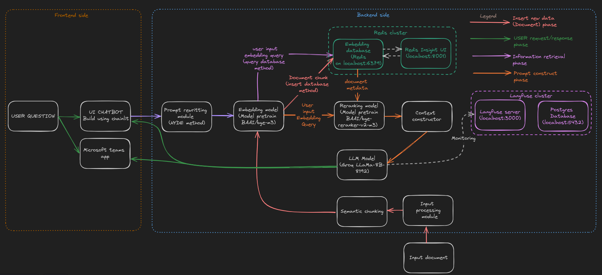

# VIETNAMESE-PRODUCTION-READY-RAG (VNPR-RAG)
[](https://github.com/khangnguyenhuu/vnpr-rag/stargazers)[](https://github.com/khangnguyenhuu/vnpr-rag/issues)
- This project aim to create a baseline RAG which you can follow to build-up your RAG in your production-enviroment
- Some highlight features:
  - RAG Chatbot with UI powered by chainlit
  - Chatbot Monitoring powered by langfuse (trace LLM reasoning, cost metrics,...)
  - Database Admin UI
  - Ingest data via API **(only accept txt)**

- Overview the project


# Disclaimer
- My project doesn't include security (network, system) so you must further develop it suit to your requirements

# Requirements
- docker version 20.10.25.
- docker-compose version 2.18.1.
- Cuda 12.1 (or maybe lower but at least 11.8).
I have tested this pipeline on amazon EC2 instance g4dn.2xlarge with 16GB vRAM Tesla T4 GPU, 8 vCPUs, 32GB memory, maybe you could use an smaller instance with low vRAM (8GB maybe goodfit depend on token length you use).
- I have also tested it without gpu, you can replace docker-compose with file docker-compose-cpu to use cpu version, it work fine but slower than gpu version.

# Getting Started
**1. Clone the repository:**
```bash
git clone https://github.com/khangnguyenhuu/vnpr-rag
cd vnpr-rag
```
**2. Deployment:**
```bash
docker-compose up (choose docker compose file suit to your system)

# option
docker-compose up -f docker-compose-mac.yml up (choose which docker-compose file you want to use)

# wait a while till the chatbot server is on (becasuse rerank model will be download (), llama-index dont have option to modify the rerank model cache dir)
```

**3. Get langfuse api key:**
 - You must go to localhost:3000 create a new project > project settings > get public/private key from langfuse
 - After that, go to .env file and replace LANGFUSE_PUBLIC_KEY and LANGFUSE_SECRET_KEY with your key, and restart your docker-compose with these command
 ```bash
 docker-compose down
 docker-compose up
 ```
 - I have no idea how to automatically get key from langfuse and replace it in .env file, so you must do it manually, you can take a look about on [langfuse-issuse](https://github.com/langfuse/langfuse/issues/517) to get information about this feature.
 - Without langfuse (or connection between your system with langfuse) our system will work fine, but it can't monitor LLM.

**4. (Optional) Deploy without docker**
Maybe this repo can deploy without docker soon, but not now :(, cause i experiment all in docker, and this project have a lot of dependencies need deploy in same time not only our bot but also our monitoring, vector database, etc.

# After deployment

We can test our bot via some tunnel like [ngrok](https://ngrok.com/)
```markdown
ngrok http <port>
Example:
 bash command: ngrok http 8000
 ngrok will return a url to access to our bot (it is alternative of localhost:8000 so you just need <ngrok_url>/chainlit like https://8095-52-221-82-203.ngrok-free.app/chainlit to access to our bot)
```

# API/endpoint interface
| Endpoint | Desription | Params |
|----------|----------|----------|
|localhost:8001|Redis Insight UI for manage our database| - |
|localhost:3000|Langfuse LLM monitoring for manage our LLM with a lot of features like cost metrics, prompt settings,...|-|
|localhost:8000/chainlit|Chatbot UI for interact with our bot|-|
|localhost:8000/uploadFile|Endpoint ingest document data to vector database **(only accept txt file)**|Body accept: file-like object with key "uploaded_file", you can checkout postman collection in /postman to have a view about how to use this endpoint|

# How to use Configs:
We will take a look into 2 configs:

**1. Enviroment configs**

Check .env file

| Endpoint | Type | Desription |
|----------|----------|----------|
|GROQ_API_KEY|string| API of Groq, can obtain [from there](https://console.groq.com/keys), currently this repo use Groq LLama-8b-8192 model (you can specify model in configs/config.yaml)|
|OPENAI_API_KEY|string| API keys of openapi, can obtain [from there](https://platform.openai.com/account/api-keys)|
|POSTGRES_USER|string|Postgres user, must define|
|POSTGRES_PASSWORD|string|Postgres password, must define|
|POSTGRES_PORT|string|Postgres config, must define|
|POSTGRES_DB|string|Postgres config, database name|
|LANGFUSE_HOST|string|Langfuse config|
|LANGFUSE_SALT|string|Lanfuse config, use for encrypted information in database| 
|NEXTAUTH_SECRET|string|Lanfuse config, anystring you like| 
|LANGFUSE_SECRET_KEY|string|Langfuse config, you can obtain from langfuse dashboard|
|LANGFUSE_PUBLIC_KEY|string|Langfuse config, you can obtain from langfuse dashboard|

**2. API configs**

Check configs/config.yaml
```yaml
LLM_MODEL:  
  TEMPERATURE: 0.3 
  STREAM: True # is stream or not
  MAX_TOKENS: 8192
  SERVICE: groq # specify service to use, OpenAI, Groq is currently supported
  LLM_MODEL_ID: llama3-8b-8192 # specify model of service to use

EMBEDDING_MODEL:
  EMBEDDING_MODEL_NAME: BAAI/bge-m3 # embedding model to use, this model i have tested on Vietnamese, it work well
  EMBEDDING_SERVICE: hf # [openai, hf] embedding service, hf equal to huggingface
  EMBEDDING_DIMS: 1024 # equal to hidden size of output of embedding model, leave it 1024 when you use BAAI/bge-m3
  EMBEDD_BATCH_SIZE: 1 # batch size to embedd, set it to suit with your GPU, if you encouter OOM, set it to 1
  MAX_LENGTH: 2048 # max length of the embedding model, all the other text over than max length will be truncated, you can tune it to what ever you want suit to your dataset and GPU, reduce it if you encounter OOM

LLM_RECOMMEND_MODEL:
  ENABLE_QUESTION_RECOMMENDER: False # setup false to default, DONT TURN ON, feature will coming soon
  QR_SERVICE:  # [ ollama, openai, groq, gemini ] # LEAVE THIS BLANK, THIS IS THE CONFIG OF ABOVE LINE
  QR_MODEL_ID: # ALSO THE SAME OF ABOVE

VECTOR_DATABASE:
  VECTOR_STORE_TYPE: "redis"  # currently support redis (maybe i will update more later)
  SIMILARITY_TOP_K: 5 # top document return when do semantic search in vector DB
  REDIS_HOST: "redis://redis_db:6379" # redis endpoint, keep default if you use docker-compose

RERANK_MODEL:
  MODEL_NAME: "BAAI/bge-reranker-v2-m3" # model to rerank
  RERANK_TOP_N: 5 # top document return when do reranking after semantic search

GENERAL_CONFIG:
  DATABASE_DOCUMENT_STORE_FOLDER: database/tmp_documents # local folder to save all the data user uploaded
```

# Acknowledgement
Thanks for wonderful works of:
- [Llama index](https://github.com/run-llama/llama_index) for RAG building
- [Langfuse](https://github.com/hwchase17/langchain) for LLM Monitoring
- [AIO_Research_Agent](https://github.com/AIVIETNAMResearch/AIO_Research_Agent) for base code of this project
- [Groq-API](https://console.groq.com/keys) Free + Exstream speed (cost effective) solution for LLM (hehe i used to test my bot for 2 weeks with just < 1$ cost when call api llama3-8b-8192)

This project also use postgresql for langfuse database and redis for vector storing in RAG system

# TODO-LIST:
- Update AI Agent (for my experiment, AI Agent is not good for database query job, hmm any contribute hope you open PR or tell me in inssue)
- User feedback monitoring (for evaluate, create dataset purpose)
- Support more datatype (pdf,...)

